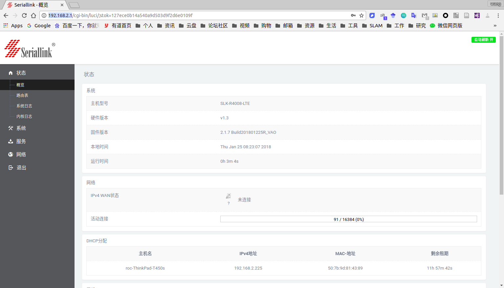
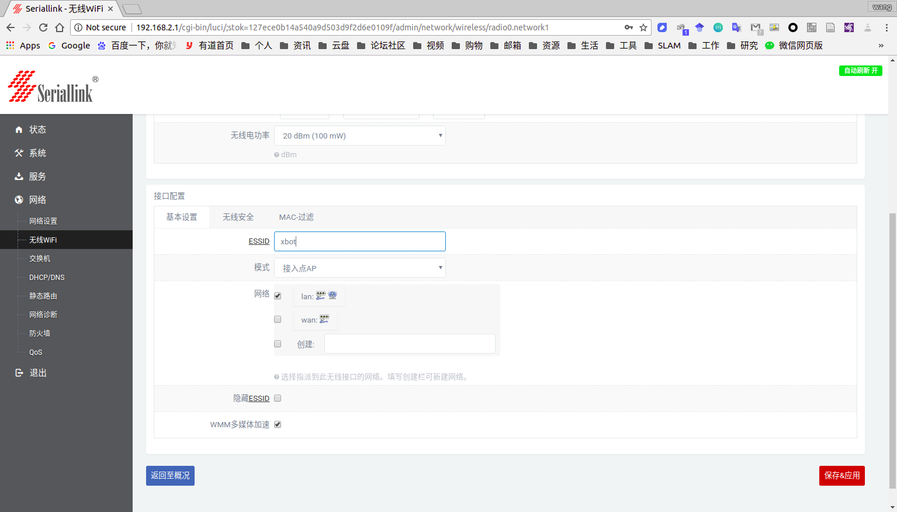
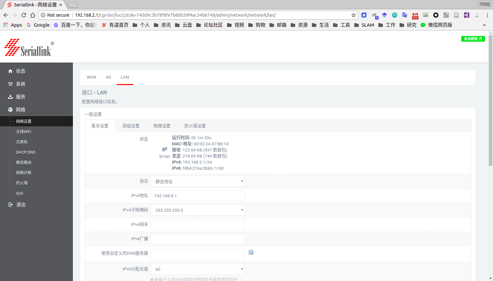
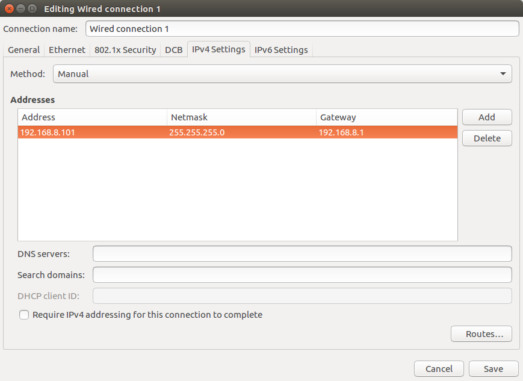

# installXBot-U一键安装说明
## 一 系统安装

新到的NUC主机一般都会让供货商先装上128Gb的固态硬盘和8GB的内存条，而且预装的系统为ubuntu16.04，初始用户名和密码为：

> 用户名：ubuntu　
>
> 密码：１

我们的Xbot-U手册当中规定的机器人主机用户名密码统一为:

> 用户名:xbot
>
> 密码:xbot1234

因而在登录ubuntu用户之后需要创建一个名为xbot的新用户,然后将xbot加入root权限当中,再之后重启登录xbot用户删除原先的ubuntu用户(也可以保留,无影响),操作指令为:

> sudo adduser xbot
>
> sudo  chmod +w /etc/sudoers
>
> sudo gedit /etc/sudoers  #编辑中在 root    ALL=(ALL:ALL) ALL之后加入一行xbot    ALL=(ALL:ALL) ALL

重启之后运行:

> sudo userdel ubuntu

然后修改root密码

> sudo -i
>
> passwd

即完成系统安装

## 二 一键安装所有程序

打开命令行运行

> sudo apt install git
>
> git clone https://github.com/DroidAITech/installXbot2.git
>
> cd installXbot2
>
> ./installXbot-U

安装时间可能较长,请耐心等待.

## 三 配置机器人路由器网络

机器人接上显示屏后打开火狐浏览器,进入网址http://192.168.2.1,输入密码admin进入路由器配置界面.

进入网络-无线wifi-修改

修改ESSID为xbot,在无线安全中修改密码为xbot1234

修改网络-网络设置-LAN页面下的IPv4地址为192.168.8.1

以上每一次修改完都需要保存,路由器设置完毕.

## 四 配置机器人网络

桌面上打开设置-Network-Wired-Options-IPv4 Settings中设置如图

保存后断开网络再连接,查看机器人ip地址已改为192.168.8.101即成功.

## 五 测试机器人

机器人接上显示屏然后在命令行分别启动机器人驱动包

> roslaunch xbot_bringup xbot.launch

另外启动一个命令行窗口运行

> rosrun xbot_tools keyboard_control.py

后按前后左右箭头控制机器人直行和旋转,查看结果.

在新的命令行窗口运行

> rqt_plot

在出现的窗口中选择红外或者超声的topic查看图形.

